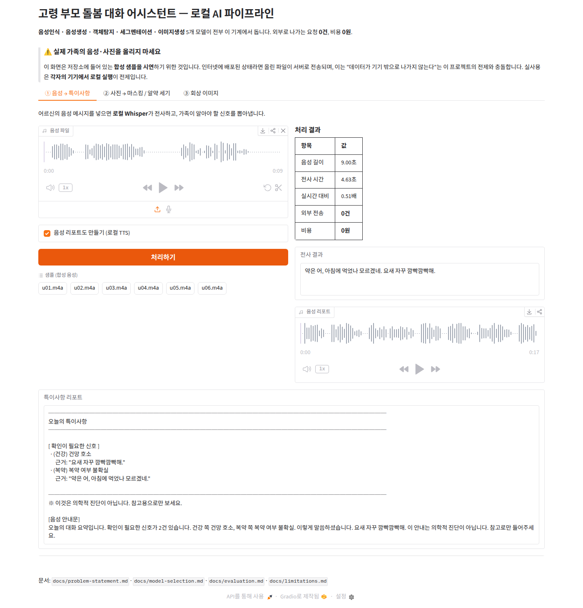
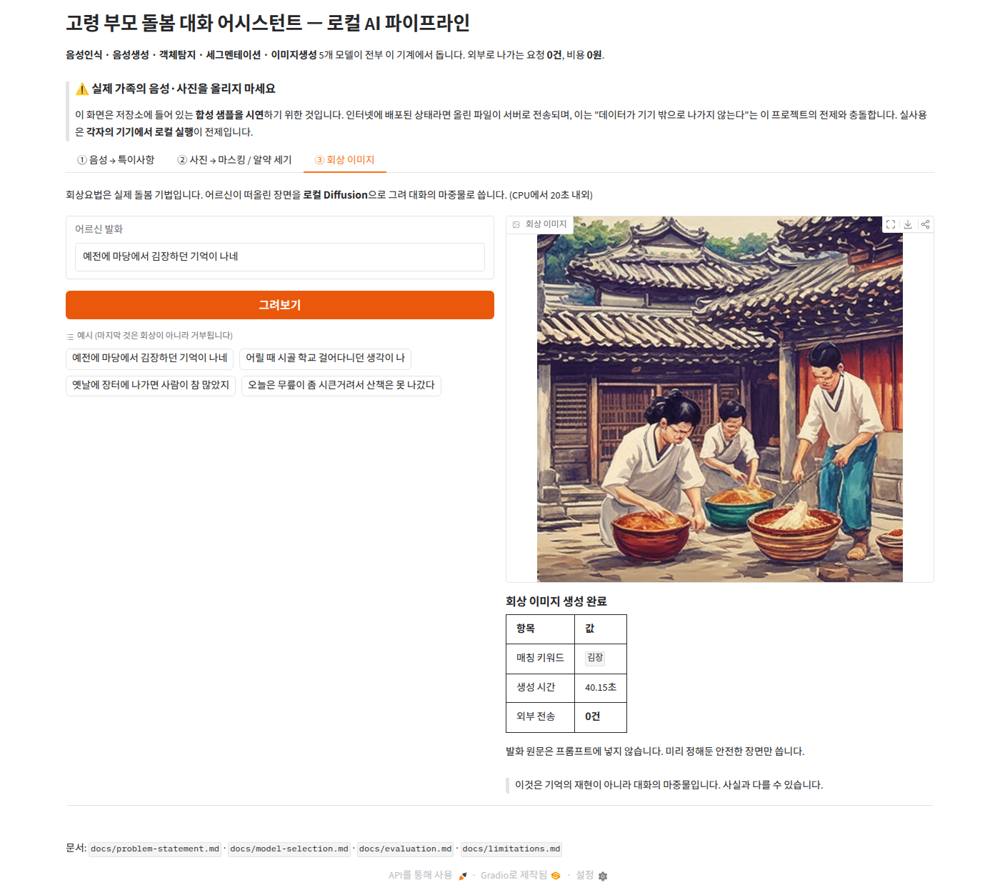

# 고령 부모 돌봄 대화 어시스턴트 — 클라우드 AI를 집 안으로 내리기

> **Main Quest 2** · 내 도메인에서 AI로 개선 지점 찾아서 PoC 만들기

떨어져 사는 가족을 위한 메신저 기반 돌봄 대화 어시스턴트를 운영 중이다.
어르신은 **음성으로** 답하고, 봇이 알아듣고 대화를 잇는다.
그런데 그 음성이 **매번 클라우드로 나가고 있었다.**

이 PoC는 음성인식을 클라우드 범용 LLM에서 **로컬 전용 모델로 내리고**,
그 뒤에 **특이사항 추출**을 붙인다. 사진 처리와 음성 합성까지 같은 원칙으로 로컬화했다.

**5개 모델이 전부 GPU 없는 CPU 한 대에서 돈다. 외부로 나가는 요청 0건, 비용 0원.**

---

## 한눈에 보기

| 성공 기준 | 목표 | 개선안 (로컬) | 기존 (클라우드) | |
|---|---|---|---|---|
| 문자오류율 CER | 악화 3%p 이내 | 0.0131 | 0.0075 | ✅ |
| 처리 속도 | 실시간 1배속 이내 | **RTF 0.38** | RTF 1.82 | ✅ |
| 건당 비용 | 0원 | **0원** | 약 0.16원 | ✅ |
| 외부 전송 | 0건 | **0건** | 19건 | ✅ |
| 특이사항 재현율 | 70% 이상 | **1.000** | — | ✅ |

**정확도는 로컬이 1.4배 나쁘다.** 대신 4.3배 빠르고, 음성이 밖으로 안 나가고, 돈이 안 든다.
이 도메인에서는 그 교환이 성립한다고 판단했다.

> **결론 — 다섯 기준을 모두 넘었다. 다만 이 PoC는 "배포해도 된다"가 아니라
> "검토할 값이 있다"는 근거다.** 실제 어르신 대상 검증이 남아 있다.
> → [9. 결론](#9-결론)

**바로 돌려보기** (Python 3.12 · ffmpeg 필요 → [상세](#50-실행-환경-요구사항))

```bash
git clone https://github.com/nike1137-svg/poc-elder-care-local-ai.git
cd poc-elder-care-local-ai
python3 -m venv .venv && source .venv/bin/activate
pip install -r requirements.txt
python src/pipeline.py data/audio/u13.m4a
```

평가용 음성은 저장소에 들어 있어 따로 만들 필요가 없습니다.
설치에 10~20분, 첫 실행에 모델 내려받는 시간이 더 걸립니다.

**바로 가기** ·
[문제](#1-문제--무엇이-잘못되어-있었나) ·
[개선](#2-개선--무엇을-했나) ·
[결과](#3-결과) ·
[동작 화면](#4-동작-화면) ·
[실행 방법](#5-실행-방법) ·
[문서 7종](#6-문서) ·
[배운 것](#7-이-poc에서-실제로-배운-것) ·
[한계](#8-한계-짧게)

**핵심 문서** ·
[문제 정의서](docs/problem-statement.md) ·
[모델 선정 근거](docs/model-selection.md) ·
[검증 결과](docs/evaluation.md) ·
[실패 사례](docs/failure-cases.md) ·
[한계](docs/limitations.md)

---

## ⚠️ 데이터 취급 원칙 (먼저 읽어주세요)

**이 저장소에는 실서비스 코드도, 실제 사용자의 음성·사진도 없습니다.**
평가용 음성은 전량 창작 대본 기반 TTS 합성이고, 평가용 이미지는 전량 Diffusion 생성입니다.

**대체된 것은 데이터뿐입니다.** 파이프라인은 실서비스와 똑같은 형식(m4a / 16kHz / 모노)의
오디오를 받아 처리하고, 도메인 어휘도 실제 도메인에서 가져왔으며,
개선할 지점도 상상이 아니라 **돌아가는 운영 코드를 직접 읽고 특정**했습니다.

<details>
<summary><b>원칙별 조치와 그 이유 (펼치기)</b></summary>

실서비스는 고령의 가족과 나누는 실제 대화를 다룹니다. 공개 저장소에 올라가는 순간
되돌릴 수 없습니다. 그래서 이 PoC는 다음 원칙 위에 만들어졌습니다.

| 원칙 | 조치 |
|---|---|
| 실서비스 코드 미포함 | PoC는 이 저장소에서 처음부터 새로 작성 |
| 실사용자 음성 미포함 | 평가 음성은 전량 **창작 대본 → TTS 합성** |
| 실사진 미포함 | 평가 이미지는 전량 **Diffusion 생성** |
| 도메인 설명 추상화 | 실서비스명·내부 구조·가족 신상 미기재 |

합성으로 바꾼 건 **성능을 재기 위한 평가 표본**입니다.
"합성이라 쉬웠던 것 아니냐"는 반론에 대비해, 실제 사람이 낭독한 공개 데이터셋
(Zeroth-Korean 40건)으로도 함께 측정했습니다 → [evaluation.md](docs/evaluation.md)

이 제약은 우회해야 할 장애물이 아니라 **이 도메인의 본질**이고,
바로 그 제약이 "로컬로 내리자"는 개선 방향을 만들어냈습니다.
자세한 논의: [docs/problem-statement.md](docs/problem-statement.md) §0

</details>
---
## 1. 문제 — 무엇이 잘못되어 있었나

현재 음성 루프는 **양쪽 모두 외부로 나간다.**

| 방향 | 엔진 위치 | 비용 | 외부 전송 |
|---|---|---|---|
| 들어오는 음성 (STT) | 외부 클라우드 LLM | **호출당 과금** | **있음** |
| 나가는 음성 (TTS) | 외부 (edge-tts) | 0원 | **있음** |

문제는 네 가지였다.

1. **전용 ASR이 아니라 범용 LLM에 프롬프트로 "받아써줘"라고 부탁**하고 있었다
   → 정확도가 측정된 적이 없고, 모델이 말을 요약·윤색할 여지가 있다
2. **유료 ↔ 프라이버시 딜레마에 갇혀 있었다**
   → 무료 티어는 데이터가 학습에 쓰일 수 있어 못 쓰고, 유료는 매일 과금된다
3. **전사 실패를 빈 문자열로 삼켰다**
   → 어르신은 말했는데 봇은 못 들은 척, 실패 통계조차 없었다
4. **전사 이후가 없었다**
   → "무릎이 시큰거려", "약을 안 먹었어" 같은 신호가 대화에 묻혔다

---

## 2. 개선 — 무엇을 했나

```
음성(m4a)
  → [VAD 관문]  말소리 있나?  ─── 없으면 즉시 실패 보고 (0.1초)
  → [Whisper]   로컬 전사     ─── 도메인 어휘 프롬프트로 튜닝
  → [규칙 추출] 특이사항       ─── 건강·복약·식사·수면·기분
  → [piper]     음성 리포트    ─── 로컬 TTS

사진
  → [YOLO]      인물 탐지     ─── COCO `person`
  → [MobileSAM] 정밀 분할     ─── 모자이크로 신원 제거
  → [FastSAM]   알약 세기     ─── 복약 확인

회상 발화
  → [SD-Turbo]  회상 이미지    ─── 회상요법 대화 촉진
```

### 5개 모델이 각자 필요한 자리에 있다

| 모델 | 하는 일 | 왜 필연적인가 |
|---|---|---|
| **Whisper small** | 음성 → 텍스트 | 어르신은 타이핑을 못 한다. 유일한 입력 수단 |
| **piper (ko_KR-kss)** | 텍스트 → 음성 | TTS도 외부로 나가고 있었다. 루프를 닫는 조각 |
| **YOLO11n** | 인물 탐지 | 사진 속 신원을 가리려면 먼저 찾아야 한다 |
| **MobileSAM / FastSAM** | 정밀 분할 | 박스로 가리면 배경까지 뭉갠다 / 알약은 클래스가 없어 SAM만 가능 |
| **SD-Turbo** | 이미지 생성 | ① 실사진을 못 쓰니 평가 이미지를 만들어야 한다 ② 회상요법 |

> 배운 모델을 다 넣은 게 아니라, **실사진·실음성을 쓸 수 없다는 제약**이
> 각 모델을 필요한 자리로 데려왔다.

---

## 3. 결과

### 성공 기준 대비

기존 방식(클라우드 LLM 프롬프트 전사)을 **같은 데이터에 실제로 돌려** 나란히 비교했다.

| 기준 | 목표 | 개선안(로컬) | 기존(클라우드) | |
|---|---|---:|---:|:-:|
| **S1** 문자오류율 | 악화 3%p 이내 | 0.0131 | **0.0075** | ✅ |
| **S2** 처리 시간 | 실시간 1배속 이내 | **RTF 0.38** | RTF 1.82 | ✅ |
| **S3** 비용 | 0원 | **0원** | 약 0.16원/건 | ✅ |
| **S4** 외부 전송 | 0건 | **0건** | 19건 | ✅ |
| **S5** 특이사항 재현율 | 70% 이상 | **1.000** | — | ✅ |

**다섯 항목 모두 달성했다. 다만 S1은 "이긴" 게 아니라 "용인 범위 안에서 진" 것이다.**

기존 방식이 CER 0.0075로 더 정확했다. 숨길 이유가 없다. 대신 기존 방식은
**RTF 1.82로 실시간을 넘겼고**(S2 위반), 호출 한도로 **1건이 실패했으며**(19/20),
매 건 음성을 밖으로 내보낸다.

> 문자 1만 개당 **56자를 더 틀리는 대신**, 처리는 **4.3배 빨라지고**,
> 비용은 **0원**이 되고, 음성이 **집 밖으로 한 번도 나가지 않는다.**

흥미로운 것은 **두 방식이 같은 단어에서 같이 틀렸다**는 점이다.
"시큰거려서"를 클라우드는 "시끈거려서", 로컬은 "식흥거려서"로 적었다.
도메인 어휘 문제는 클라우드로 옮긴다고 풀리지 않는다 —
그래서 프롬프트 튜닝으로 풀었다. 자세한 비교: [docs/evaluation.md](docs/evaluation.md) §6

### 주요 수치

| 항목 | 값 |
|---|---|
| 전사 성공률 | **60/60** (합성 20 + 공개셋 40) |
| 처리 속도 | 7초 음성 → **2.7초** (실시간의 3배) |
| 하이퍼파라미터 튜닝 | CER **-28.8%** (학습 없이, 프롬프트만) |
| 강건성 테스트 환각 | **0건** |
| 알약 세기 상대 오차 | **3.0%** (±1개 이내 7/7) |
| 전체 파이프라인 | 7초 음성 → 리포트까지 **3.8초** |

---

## 4. 동작 화면

### 음성 → 전사 → 특이사항 → 음성 리포트



음성 9.00초를 4.63초에 전사(실시간 0.51배), 특이사항 2건 추출,
17초 분량 음성 리포트 생성. **외부 전송 0건, 비용 0원.**

### 사진 → 인물 마스킹


YOLO가 인물을 찾고 SAM이 윤곽을 따내 모자이크. **얼굴은 알아볼 수 없고 장면 맥락은 남는다.**

### 회상 이미지 생성



"예전에 마당에서 김장하던 기억이 나네" → 로컬 Diffusion으로 40초에 생성.
회상이 아닌 발화는 거부한다.

### 왜 라이브 데모 URL이 없는가 — 의도적으로 배포하지 않았습니다

웹 데모(`app.py`)는 만들었지만 **로컬 실행 전용**입니다. 인터넷에 올리지 않은 것은
미룬 게 아니라 **하지 않기로 결정한 것**입니다.

이 PoC의 주장 전체가 **"음성·사진이 기기 밖으로 나가지 않는다"**입니다.
그런데 공개 배포하면 **사용자가 올린 파일이 서버로 전송됩니다.** 주장과 정면으로 충돌합니다.
그래서 앱 화면 상단에도 같은 경고를 고정으로 띄워둡니다.

> ⚠️ 실제 가족의 음성·사진을 올리지 마세요. 이 화면은 합성 샘플 시연용입니다.
> 실사용은 각자의 기기에서 로컬 실행이 전제입니다.

배포로 얻는 편의보다 **전제를 스스로 무너뜨리는 비용이 크다**고 판단했습니다.
누구나 `python app.py` 한 줄로 자기 기기에서 띄울 수 있고, 그게 이 프로젝트가 의도한
사용 형태입니다. 자세한 논의는 [limitations.md](docs/limitations.md) §5.5.

---

## 5. 실행 방법

### 5.0 실행 환경 요구사항

이 저장소는 아래 환경에서 만들어졌고, 모든 수치도 여기서 측정했습니다.

| 항목 | 요구 | 개발·측정 환경 |
|---|---|---|
| **Python** | **3.12** (권장·검증됨) | 3.12.3 |
| OS | Linux / macOS / WSL2 | Ubuntu (Linux) |
| CPU | 4코어 이상 | 8코어 |
| GPU | **불필요** | 없음 |
| 외부 도구 | `ffmpeg`, `git` | — |

RAM과 디스크는 **어디까지 쓰느냐**에 따라 크게 다릅니다.

| 쓰는 기능 | RAM | 디스크 |
|---|---|---|
| 음성 전사 + 특이사항 (§5.2) | **2GB** | 약 **3GB** (가상환경 2.5GB + Whisper 0.5GB) |
| \+ 사진 마스킹·알약 세기 | 3GB | 약 3GB (YOLO·SAM 합쳐 50MB) |
| \+ 회상 이미지 생성 | **6GB** | 약 **6GB** (SD-Turbo 2.5GB 추가) |

> 가상환경 2.5GB는 **실측치**입니다(패키지 108개). 대부분이 PyTorch입니다.
> **회상 이미지를 안 쓰신다면 RAM 2GB·디스크 3GB로 충분합니다.**

> ⚠️ **의존성 버전이 `==` 로 고정되어 있습니다.** 같은 결과를 재현하기 위한 의도이지만,
> **Python 3.12가 아니면 일부 패키지의 휠이 없어 설치가 실패할 수 있습니다.**
> 3.11 이하나 3.13 이상을 쓰신다면 `requirements.txt`의 `==` 를 `>=` 로 바꾸거나,
> `pyenv` 등으로 3.12를 쓰세요.

**시작 전에 한 번에 확인:**

```bash
python3 --version; free -h | sed -n '2p'; df -h ~ | tail -1; which git ffmpeg
```

#### 윈도우(WSL2)에서 쓸 때

동작합니다. 다만 세 가지를 먼저 확인하세요.

| 항목 | 확인 | 안 맞으면 |
|---|---|---|
| **파이썬** | Ubuntu **24.04**는 3.12 기본 탑재 | 22.04는 3.10이라 3.12를 따로 설치해야 함 |
| **메모리** | WSL2는 기본적으로 윈도우 RAM의 **절반**만 씁니다 | 가용 6GB 미만이면 **회상 이미지 생성이 `Killed`로 죽습니다.** 그 기능만 건너뛰면 나머지는 정상 |
| **위치** | `~`(WSL 내부)에 클론 | `/mnt/c/...`에 두면 파일 접근이 몇 배 느립니다 |

WSL 메모리를 늘리려면 윈도우에서 `%USERPROFILE%\.wslconfig` 를 만들고 아래를 넣은 뒤 `wsl --shutdown` 합니다.

```ini
[wsl2]
memory=8GB
```

**잘 되는 것들**: 웹 데모(`python app.py`)는 윈도우 브라우저에서 `localhost:7860` 으로 바로 열립니다.
WSL에 사운드 장치가 없어도 음성 재생은 브라우저에서 되므로 문제없습니다.

### 5.1 준비

**① 저장소를 받습니다.**

```bash
git clone https://github.com/nike1137-svg/poc-elder-care-local-ai.git
cd poc-elder-care-local-ai
```

공개 저장소라 로그인 없이 받아집니다.

> ### 🪟 WSL2 사용자는 **받는 위치가 중요합니다**
>
> 반드시 **`cd ~` 먼저** 하고 받으세요.
>
> ```bash
> cd ~ && git clone https://github.com/nike1137-svg/poc-elder-care-local-ai.git
> ```
>
> `/mnt/c/...`(윈도우 드라이브)에 두면 WSL에서 파일 접근이 몇 배 느립니다.
> 설치가 3~5분이 아니라 **10~20분**이 되고, 모델 로딩도 계속 답답합니다.
>
> 이미 `/mnt/c` 에 받으셨다면 옮기면 됩니다.
>
> ```bash
> mv /mnt/c/Users/<사용자명>/poc-elder-care-local-ai ~/ && cd ~/poc-elder-care-local-ai
> ```
>
> 가상환경(`.venv`)은 경로가 박혀 있어 같이 옮기면 깨집니다. 옮긴 뒤 지우고 다시 만드세요.
> `rm -rf .venv` 후 아래 ③ 단계부터 다시 하면 됩니다.

**② `ffmpeg`을 설치합니다.** 오디오 형식 변환에 반드시 필요합니다.

```bash
sudo apt install -y ffmpeg     # Ubuntu / Debian / WSL2
```

macOS는 `brew install ffmpeg` 입니다.

**③ 가상환경을 만들고 의존성을 설치합니다.** **2GB 넘게 내려받으므로 네트워크에 따라 10~20분** 걸립니다.

```bash
python3 -m venv .venv && source .venv/bin/activate && pip install -r requirements.txt
```

> ⚠️ 이 명령은 **저장소 폴더 안에서** 실행해야 합니다. `requirements.txt` 가 그 안에 있습니다.
> `Could not open requirements file` 오류가 나면 ① 단계를 건너뛰신 겁니다.

> ### ⏳ 멈춘 것처럼 보이는 구간이 있습니다 — 정상입니다
>
> 다운로드가 끝나면 아래 줄이 뜨고 **한동안 아무 출력이 없습니다.**
>
> ```
> Installing collected packages: pytz, pydub, ... gradio
> ```
>
> 패키지 105개를 실제로 푸는 단계인데 진행 표시가 없습니다.
> PyTorch 하나가 압축 191MB라 여기서만 **3~5분**(WSL의 `/mnt/c` 에서는 **10~20분**) 걸립니다.
>
> 확인하고 싶으면 **다른 터미널**에서 크기가 늘고 있는지 보세요. 2.5GB 근처에서 끝납니다.
>
> ```bash
> du -sh .venv
> ```

> 설치되는 PyTorch는 **CPU 전용 휠**입니다(`torch-2.13.0+cpu`). `requirements.txt` 상단의
> `--extra-index-url` 이 그 역할을 합니다. GPU를 쓰실 거라면 그 줄을 지우고 설치하세요.

> ✅ **이 절차는 새 환경에서 실제로 검증했습니다.** 빈 디렉터리에 새로 클론해 위 명령을
> 그대로 실행한 결과, 패키지 108개가 오류 없이 설치되고 §5.2의 출력이 **글자까지 동일하게**
> 재현되었습니다.

한국어 TTS 음성 모델(61MB)을 내려받는다. (음성 리포트를 쓸 때만 필요)

```bash
mkdir -p models/piper
curl -L -o models/piper/ko_KR-kss-medium.onnx \
  "https://huggingface.co/rhasspy/piper-voices/resolve/main/ko/ko_KR/kss/medium/ko_KR-kss-medium.onnx"
curl -L -o models/piper/ko_KR-kss-medium.onnx.json \
  "https://huggingface.co/rhasspy/piper-voices/resolve/main/ko/ko_KR/kss/medium/ko_KR-kss-medium.onnx.json"
```

### 5.2 가장 빠르게 확인하기 — 30초

```bash
python src/pipeline.py data/audio/u13.m4a
```

평가용 음성은 **저장소에 이미 들어 있어서** 따로 만들 필요가 없습니다.

> **최초 1회는 Whisper 모델(약 500MB)을 자동으로 내려받습니다.** 네트워크에 따라 1~5분.
> `Downloading...` 이 뜨면 정상이니 기다리세요.
> 모델이 받아진 뒤에는 **전체 15초, 전사 자체는 3초**입니다(실측).

이런 결과가 나오면 성공입니다.

```
음성 길이 7.01s  →  전사 2.729s (실시간 대비 0.389배)
외부 전송 0건   비용 0원

[ 전사 결과 ]
  속이 좀 안 좋아서 아침을 걸렀어. 죽이라도 좀 쒀 먹을까 싶다.

──────────────────────────────────────────────────────────
오늘의 특이사항
──────────────────────────────────────────────────────────

[ 확인이 필요한 신호 ]
  · (건강) 소화기 이상
      근거: "속이 좀 안 좋아서 아침을 걸렀어."
  · (식사) 결식
      근거: "속이 좀 안 좋아서 아침을 걸렀어."
```

전사 결과의 글자가 몇 개 다를 수는 있지만, **특이사항 두 건은 동일하게 나와야 합니다.**

실패를 어떻게 다루는지 보고 싶다면 무음 파일을 넣어보세요.

```bash
python src/pipeline.py data/stress/silence.m4a
```

빈 문자열로 넘어가지 않고 `no_speech` 로 **실패를 실패라고 보고**합니다.

### 5.3 웹 데모 — 전 기능을 화면으로

```bash
python app.py
```

브라우저에서 `http://127.0.0.1:7860` 을 엽니다. 세 탭에서 다섯 모델을 전부 확인할 수 있습니다.

| 탭 | 해볼 것 | 걸리는 시간 |
|---|---|---|
| ① 음성 | 샘플 `u03.m4a` 클릭 → 처리하기 | 첫 회 30초, 이후 4초 |
| ② 사진 | `data/images/person_01.png` 업로드 → 인물 마스킹 | 첫 회 20초, 이후 2초 |
| ② 사진 | `data/images/pill_01.png` → 알약 세기 | 1초 |
| ③ 회상 | "예전에 마당에서 김장하던 기억이 나네" | **40초** (그림 생성) |

> **처음 누르는 버튼은 항상 느립니다.** 그때 모델을 메모리에 올리기 때문입니다.
> 남에게 시연하실 거라면 **미리 한 번씩 눌러 예열**해두세요.

> ⚠️ 회상 탭은 **RAM 6GB**를 씁니다. 메모리가 8GB 미만이면 이 탭은 건너뛰세요.
> 나머지 기능은 RAM 2GB면 충분합니다.

종료는 터미널에서 `Ctrl+C` 입니다.

### 5.4 평가 재현

```bash
# 평가용 음성 생성 (저장소에 이미 들어 있음)
python src/build_dataset.py

# 공개 데이터셋 준비 (약 58MB 내려받기)
curl -L -o data/zeroth/test.parquet \
  "https://huggingface.co/datasets/Bingsu/zeroth-korean/resolve/main/data/test-00000-of-00001-a41b955a631e582e.parquet"
python src/prepare_zeroth.py

# 개선안 측정
python src/evaluate.py --backend whisper --dataset both

# 특이사항 추출 채점
python src/eval_signals.py --stt-result results/whisper_whisper-small_synthetic.json

# 하이퍼파라미터 스윕
python src/tune_whisper.py --dataset synthetic

# 강건성 테스트
python src/robustness_test.py

# 이미지 파이프라인
python src/gen_images.py          # 평가 이미지 생성 (SD-Turbo, 장당 20초)
python src/image_pipeline.py --all
python src/pill_benchmark.py      # 알약 세기 정확도

# 주간 집계
python src/weekly_report.py --demo
```

### 5.5 기존 방식과 비교 (선택)

```bash
cp .env.example .env
# .env 에 GEMINI_API_KEY 입력 — https://aistudio.google.com/apikey 무료 발급
python src/evaluate.py --backend gemini --dataset synthetic
```

> 평가 데이터가 합성 대본이라 무료 티어를 써도 프라이버시 문제가 없다.
> 실서비스가 무료 티어를 못 쓰는 이유("실제 가족 대화라서")가 이 PoC의 출발점이다.

### 5.6 Colab

GPU 환경에서 더 큰 모델까지 돌려볼 수 있다.

[`notebooks/poc_demo.ipynb`](notebooks/poc_demo.ipynb)

### 5.7 막혔을 때

| 증상 | 원인과 해결 |
|---|---|
| `pip install` 이 버전 오류로 실패 | **Python 3.12가 아닙니다.** §5.0 참고. 급하면 `requirements.txt`의 `==` 를 `>=` 로 바꾸세요 |
| `ffmpeg not found` / `ffprobe not found` | `sudo apt install -y ffmpeg` |
| 첫 실행이 몇 분째 멈춘 듯함 | **모델 내려받는 중입니다.** Whisper 500MB, SD-Turbo 2.5GB. 정상입니다 |
| `Killed` 로 죽음 | **메모리 부족.** 회상 이미지(SD-Turbo)는 RAM 6GB가 필요합니다. 음성 기능만 쓰세요 |
| 회상 이미지가 너무 느림 | CPU에서 40초는 정상입니다. Colab GPU를 쓰면 1~2초입니다 |
| 전사 결과 글자가 문서와 조금 다름 | **정상입니다.** 하드웨어·라이브러리 버전에 따라 몇 글자 달라질 수 있습니다. 특이사항 추출 결과는 같아야 합니다 |
| `python` 명령이 없음 | 가상환경을 켜지 않으셨습니다. `source .venv/bin/activate` |
| `GEMINI_API_KEY 가 설정되지 않았습니다` | 기준선 비교(§5.5)에만 필요합니다. **개선안만 돌린다면 무시하세요** |
| Gemini 호출이 429로 실패 | 무료 티어는 **모델당 하루 20건**입니다. [evaluation.md](docs/evaluation.md) §6.4 참고 |

**어떤 경우에도 인터넷 연결은 최초 1회만 필요합니다** (모델 내려받기). 그 뒤로는 완전 오프라인으로 동작합니다.

---

## 6. 문서

| 문서 | 내용 |
|---|---|
| [problem-statement.md](docs/problem-statement.md) | **문제 정의서** — 도메인·현재 문제·개선 가설·대상 사용자·성공 기준 |
| [model-selection.md](docs/model-selection.md) | **모델 선정 근거** — 후보 비교와 채택 이유 |
| [evaluation.md](docs/evaluation.md) | **검증 결과** — 정량·정성·실패 사례 |
| [tuning.md](docs/tuning.md) | **하이퍼파라미터 최적화** — 학습 없이 CER 28.8% 개선 |
| [failure-cases.md](docs/failure-cases.md) | **실패 사례** — 일부러 무너뜨려 찾은 것들과 수정 |
| [limitations.md](docs/limitations.md) | **한계와 다음 스텝** |
| [adoption-plan.md](docs/adoption-plan.md) | **실서비스 도입 제안서** — 데이터·비용·운영·전환 순서 |

---

## 7. 이 PoC에서 실제로 배운 것

문서에 결과만 적기보다, **틀렸다가 고친 것**을 남긴다.

| 발견 | 조치 | 효과 |
|---|---|---|
| 무음 입력에 **44초** 소요 | VAD를 분할이 아닌 **관문**으로 사용 | **470배** 단축 |
| 합성 데이터 1등 설정이 실제 음성에서 **꼴찌** | 공개 데이터셋 **교차 검증** | 20% 악화될 설정을 걸러냄 |
| 블러를 걸었는데 **얼굴이 보임** | 모자이크 + 인물 크기 비례 | 실제로 익명화됨 |
| 알약 세기 오차 **24%** | 원인은 모델이 아니라 **오염된 배경 데이터** | 오차 **3%** |
| 데모에서 모델 **재적재 낭비** | 프로세스당 1회 적재 | **133배** 단축 |
| 구두점 오류로 신호 **누락** | ASR 구두점을 **불신** | 재현율 0.96 → 1.00 |

> 다섯 가지가 실측·테스트로 발견됐고 수정으로 이어졌다.
> 테스트를 안 만들었다면 모두 실서비스에서 터졌을 것이다.

---

## 8. 한계 (짧게)

- **평가 음성이 합성이다.** 실제 고령 화자의 떨림·방언·웅얼거림은 재현하지 못했다
- **특이사항 추출 점수는 과대평가다.** 대본과 규칙을 같은 사람이 썼다
- **표본이 작다.** 합성 20건 + 공개셋 40건
- **기존 방식이 더 정확했다.** CER 0.0075 대 0.0131. 용인 범위 안이지만 진 것은 사실이다
- **기준선 측정에 실서비스와 같은 모델을 못 썼다.** `gemini-2.5-flash`가 신규 사용자에게
  더 이상 제공되지 않아 현행 flash 별칭으로 대체했다
- **기준선 결과 JSON이 남아 있지 않다.** 재실행 중 덮어써졌고 무료 할당량이 소진돼
  재생성하지 못했다. 수치는 실측이며 할당량 회복 후 한 줄 명령으로 재생성된다
- **겹친 알약은 못 센다.** 벤치마크는 떨어뜨려 배치했다

자세한 내용: [docs/limitations.md](docs/limitations.md)

---

## 9. 결론

> **교체를 검토할 근거는 만들어졌다. 교체를 확정할 근거는 아직 아니다.**

기존 방식과 직접 비교까지 마쳤고, 성공 기준 다섯 개를 모두 통과했다.
**그런데도 "확정"이라고 쓰지 않는 이유**는 이 PoC가 증명하지 못한 것이 남아서다.

- 평가 음성이 합성이다 → **실제 어르신 발화에서의 정확도는 여전히 모른다**
- 표본이 20건이다 → 0.56%p 차이가 표본 오차와 구분되는지 단정할 수 없다
- 기준선을 실서비스와 동일한 모델로 재지 못했다

다음 수순은 실데이터를 저장소에 올리지 않고도 할 수 있는 것 —
**실서비스에서 전사 실패율만 재보는 것**이다. 정답 전사문 없이도 잴 수 있고,
대화 내용을 저장하지 않아도 된다. 방법은 [adoption-plan.md](docs/adoption-plan.md) §5에 있다.

---

## 관련 작업 (별도 프로젝트 — 이 과제의 제출물이 아님)

같은 방식 — **성공 기준을 먼저 정하고, 미달이면 접는다** — 을 적용한 다른 PoC다.
방법론이 이번 한 번만의 것이 아님을 보이는 참고 자료로 남긴다.

- **[poc-obsidian-search](https://github.com/nike1137-svg/poc-obsidian-search)**
  작업 로그 281건에 임베딩 기반 의미 검색을 적용해봤으나,
  **성공 기준 3개 중 2개 미달로 구축을 보류**했다.
  기존 `grep`·BM25가 더 나았다는 결과를 그대로 기록해 남겼다.

> PoC의 정상적인 결론 중 하나는 **"만들지 않기로 한다"**이다.
> 이번 과제가 "교체를 확정하지 않고 검토 근거까지"에서 멈춘 것도 같은 이유다.

---

## 라이선스·출처

| 항목 | 출처 / 라이선스 |
|---|---|
이 저장소의 코드·문서·생성 데이터는 **MIT 라이선스**입니다 ([LICENSE](LICENSE)).
의존하는 모델·라이브러리는 각자의 라이선스를 따릅니다.

| 항목 | 출처 / 라이선스 |
|---|---|
| Zeroth-Korean | [Bingsu/zeroth-korean](https://huggingface.co/datasets/Bingsu/zeroth-korean) · CC-BY-4.0 |
| Whisper | OpenAI · MIT (faster-whisper 구현) |
| piper 한국어 음성 | [rhasspy/piper-voices](https://huggingface.co/rhasspy/piper-voices) |
| **YOLO11 / SAM** | Ultralytics · **AGPL-3.0** ⚠️ |
| SD-Turbo | [stabilityai/sd-turbo](https://huggingface.co/stabilityai/sd-turbo) · Stability AI Community License |

> ⚠️ **Ultralytics는 AGPL-3.0입니다.** 이 저장소는 해당 코드를 포함하지 않고 의존성으로만
> 씁니다만, AGPL-3.0은 **네트워크로 서비스할 경우** 소스 공개 의무가 생길 수 있습니다.
> 이 프로젝트가 웹 데모를 배포하지 않는 이유 중 하나이기도 합니다.
> 공개 배포나 상업적 사용을 계획한다면 조건을 먼저 확인하세요.

합성 음성 20건·생성 이미지 10건·대본·측정 결과는 이 저장소에서 새로 만든 것이고,
**실제 인물의 음성이나 사진은 포함되어 있지 않습니다.**
